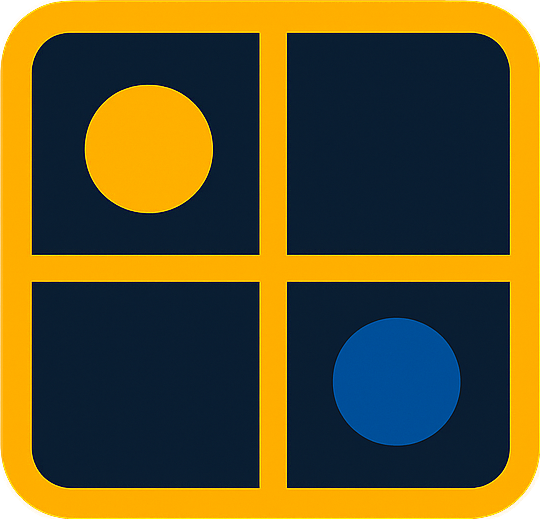
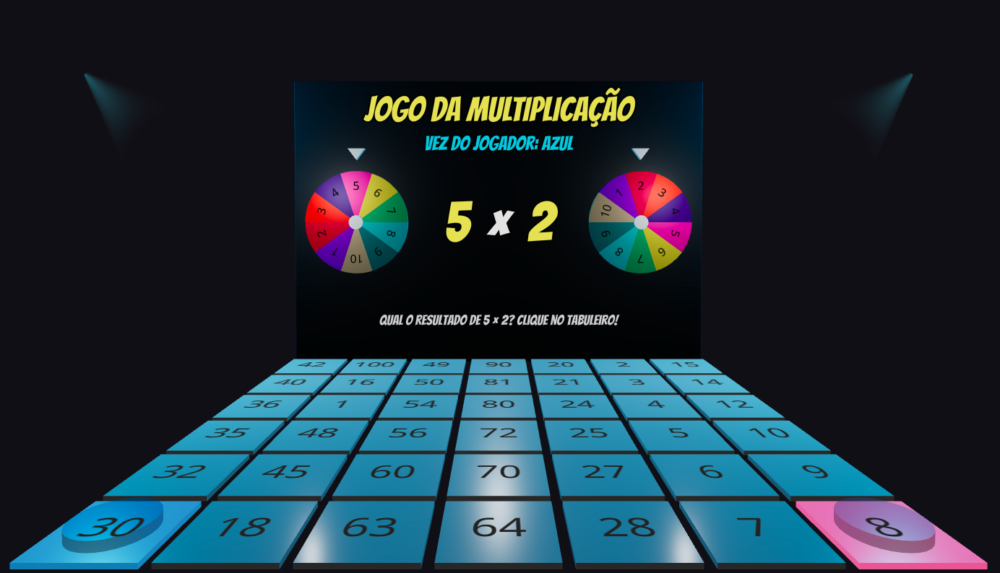

# Jogo da Multiplicação 3D

  

---

Este é um jogo de tabuleiro 3D interativo, desenvolvido para tornar a prática da tabuada de multiplicação uma experiência divertida e visualmente atraente. Desafie um amigo, personalize as regras e teste seus conhecimentos matemáticos em um ambiente 3D dinâmico construído com React e @react-three/fiber.

  

## 🚀 Sobre o Projeto

O objetivo deste projeto é criar uma ferramenta educacional que engaje os jogadores através de interatividade e um design moderno. Em vez de cartões de memorização tradicionais, os jogadores giram roletas, resolvem o problema e conquistam espaços no tabuleiro, transformando o aprendizado em uma competição amigável.

---

## ✨ Funcionalidades

- **✨ Ambiente 3D Completo:** Cena, iluminação e objetos renderizados com `@react-three/fiber`.
- **🎨 Configuração de Jogo Personalizável:** Escolha as cores dos jogadores e defina a condição de vitória antes de começar.
- **🎡 Roletas 3D Interativas:** Gire as roletas para sortear os números da multiplicação.
- **🎲 Tabuleiro Dinâmico:** Responda corretamente para marcar sua cor em uma célula do tabuleiro.
- **🔊 Efeitos Sonoros:** Feedback de áudio para giros, acertos, erros e início de jogo.
- **🎆 Animações e Efeitos Visuais:** Movimentos de câmera suaves, fogos de artifício para o vencedor e destaques visuais.

---

## 🛠️ Tecnologias Utilizadas

- **React** - Biblioteca para a interface do usuário.
- **TypeScript** - Para tipagem estática e um código mais robusto.
- **Vite** - Ferramenta de build extremamente rápida.
- **@react-three/fiber** - Renderizador React para Three.js.
- **@react-three/drei** - Coleção de helpers e componentes úteis para R3F.
- **GSAP (GreenSock)** - Para animações complexas e performáticas (câmera, roletas).
- **Tailwind CSS** & **shadcn/ui** - Para a estilização do modal de configuração.

---

## 🎮 Como Jogar

1.  **Configure o Jogo:** Na tela inicial, escolha a cor para cada jogador e a condição de vitória.
2.  **Sorteio Inicial:** Uma moeda será lançada para decidir qual jogador começa.
3.  **Gire as Roletas:** Na sua vez, clique na roleta da esquerda e depois na da direita para sortear dois números.
4.  **Calcule o Produto:** Multiplique os dois números sorteados.
5.  **Marque no Tabuleiro:** Encontre o resultado da multiplicação no tabuleiro e clique nele.
    - Se acertar, a célula será marcada com a sua cor.
    - Se errar, você perde a vez.
6.  **Vença o Jogo:** O primeiro jogador a cumprir a condição de vitória estabelecida no início é o vencedor!

---

## 🙏 Agradecimentos

- Inspirado fortemente [neste vídeo de Yasmin Karynne](https://www.youtube.com/watch?v=lI7CmidViXU), que serviu como base para a ideia.
